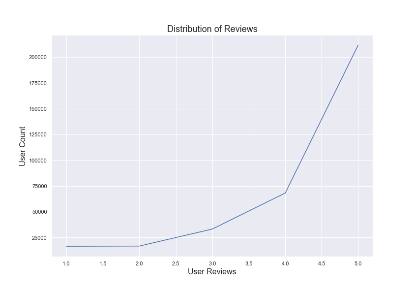
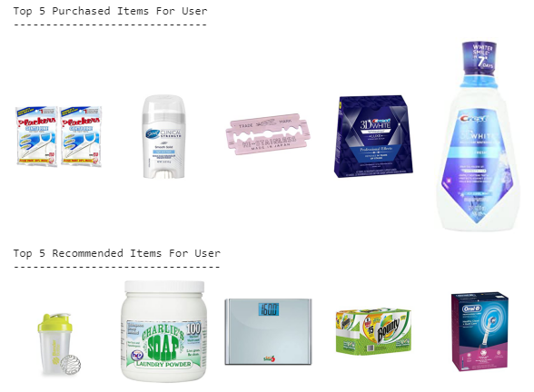

# Product Recommendation: Building a Robust Recommender

Abstract: Product recommenders are a key structure to many industries. People are searching for valuable recommendations they can use, and industries are driven to optimize profits. Using Amazon consumer reviews collected from Julian McAuley at UCSD, I focused on building a robust recommender to help consumers discover products they would enjoy. Focusing on Health and Personal Care, I built and tested a variety of recommenders to find an optimal solution.

Results: I developed a dual approach to recommending. As a cold start solution, a weighted average model was built. This model penalizes products with less than 50 reviews. This model will then recommend the top 10 items by weighted average. This simple solution had an RMSE of 1.004, but was surprisingly robust. As a solution for existing users, a collaborative based embedded neural network was used. After testing, I found simple architecture did the best with an RMSE of 0.3. 


# Background & Motivation
Recommenders are truly collaborative in nature. People are looking for products they will enjoy, and vendors are looking to better connect with consumers and sell their products. Outside of product sales, recommenders are very flexible and can be used in a variety of environments. In regards to model development, it is important to create robust models which are capable of capturing the complexity of the user and the recommended product. It is also important to consider a solution that can scale with big data.

Currently we live in a world with increasing complexity and ambiguity. With more potential choices than ever, people tend to get caught in the paradox of choice. With too many choices our ability to make a choice becomes a much more difficult task. Personalized recommenders are a great solution to this problem. As such, it should be our goal to create recommenders that work, and recommenders the consumers trust.

## The Problem
* Companies need to direct their products to interested consumers.

* Consumers are looking for the right products they can enjoy.

## The Solution

Personalized recommendations an end user can understand. Connect product to person in a smart and scalable way.

---

# Analysis methods

Libraries and modules include ```Python3```, ```NumPy```, ```Pandas```, ```Surprise```, ```LightFM```, ```Seaborn```, ```Keras```.

Data was collected from [ucsd.edu](http://jmcauley.ucsd.edu/data/amazon/links.html)</a> amazon repository. Two primary ```csv``` files titled Health and Personal Care 5 Core and Metadata were used.

```5_Core.csv``` contains reviewer id, product id, and review text.
```metadata.csv``` contains product information.

To make predictions:

* From ```src/helper``` run preprocess_pipeline class on the two csv files. This will returned a preprocessed merged dataset.

* To make predictions on existing users, from ```predictor``` directory, run ```get_predictions class``` from ```keras_predictions.py```. This returns a dictionary of bought items and recommended items.

* To get a better visual understanding of predictions, from ```keras_predictions.py``` run the ```print_images``` function on the embedded recommendations list within the returned dictionary.

---

# Amazon Recommender Deep Dive

## The Data

The original dataset contained 346,355 rows of 18,534 unique items and 38,609 unique users. Due to sparsity, this dataset was cut down to include users that have reviewed over 10 products, and products that have been reviewed over 20 times. When looking at the distribution of review count, it can be seen most reviewers only review 5 to 10 products. This distribution follows an exponential decay with a max of 310 on this dataset.


When looking at the distribution of products reviewed, we can see this follows a similar exponential trend. Most products have been reviewed 5 to 20 times while the max is around 1100 reviews. These trends are commonly seen on product review data and represent the problem with sparsity.


When going deeper into the product review distribution, it can be seen that most products fall between the 4 and 5 star ranking. The graph informed the basis for using weighted averages as a cold start solution. Many products are reviewed as 5 star products, but many of them had very few reviews.


When looking at the distribution of reviews per user, it can be seen that most reviewers rate items a 5. This makes sense as people are more motivated to review products they enjoy.




## Baseline Modeling

As a baseline model, I used average reviews per product. This model does a fairly good job, with most of the error occuring as a mis-rating of around 1. The RMSE attached to this baseline model was around 1.004, the same as the weighted average model. The median error can be seen with the dotted line.


Here is the error distribution for the weighted averages. It is about as performant as using the basic mean per product, but it is more robust in production as it can more easily account for products that are buying reviews, or products with less than 50 reviews. This model will quickly be replaced with the more robust collaborative neural network as the user makes their first purchase.


Exploring established recommender libraries such as ```Surprise```, they do better than the baseline with an average RMSE of 0.99. This is not a marked improvement however. From surprise the most robust model was SVD with an RMSE of 0.98 when tuned correctly. As can be seen, this model looks very close to the mean baseline model. For me, the gains using this model are not improved enough to make a significant enough case to drop the baseline. This really shows the use case of simple modeling.


The primary model selected as a robust recommender was a ```keras``` built embedded model. Users and products are then transformed with embedding layers where they are normalized, and regularized with an L2 penalty and transformed a coefficient vector with 50 different coefficients for each user and each product. These user vectors and product vectors are then transformed together with a dot product, and added together with a user bias as the number of unique users and a product bias as the number of unique products. Finally, this product was compressed by a sigmoid to force the rating to a number between 0 and 1.


Now that we have models that satisfy existing users and new users, lets make some predictions. For a randomly selected user, here is a visual representation of the top 5 items they have already bought, with the top 5 recommendations for this specific user. Previously purchased items are not included in our recommendation, however this might be a thing of value to have for users based on longitudinal purchases. For instance this user bought deodorant. It may be valuable to recommend them the deodorant in the future for a repurchase.




As our cold start, we recommend the same top 10 items for each new user. These items should be updated over time as more reviews come in for products. We can already see some similarity in this cold start prediction compared with our actual in that the grabber is recommended in both.


## future work and evolution

The biggest improvement we can make in predictions is getting a better sense of customer information and product information. More granular and user specific predictions can be made.
